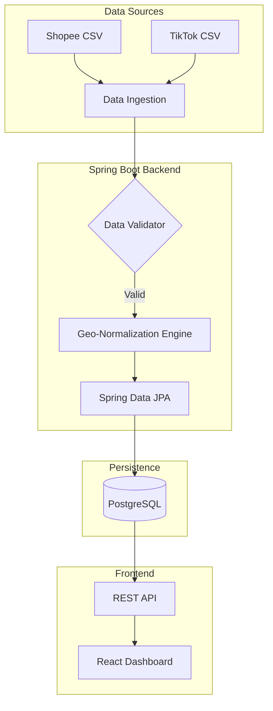

# Petalytics

**Petalytics** (from *Peta* - Indonesian for Map) is a pragmatic backend solution designed to solve a common problem in Indonesian e-commerce: **Wasted ad spend due to lack of geographic customer insights.**

## The Problem
Multi-channel marketplaces (Shopee, TikTok, etc.) provide raw order data but lack tools to visualize customer density. Sellers often "burn money" on broad ad targeting. **Petalytics** ingests raw marketplace exports and transforms them into actionable geographic intelligence.

## System Architecture

## Tech Stack
- **Backend:** Java 17, Spring Boot 3, Hibernate
- **Database:** PostgreSQL
- **Frontend:** React + Tailwind CSS (Visualization via Recharts)
- **DevOps:** Docker, GitHub Actions

## Key Features
- **Data Normalization:** Maps inconsistent Indonesian address strings into standardized regional data.
- **Multi-Platform Ingestion:** Unified processing for different marketplace schemas.
- **ROI Optimization:** Identifies high-density customer zones for precise ad targeting.